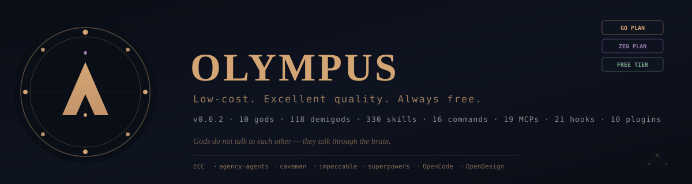

<p align="center">
  
</p>

<p align="center">
  <strong>Low-cost. Excellent quality. Always free.</strong>
</p>

<p align="center">
  
</p>

---

## What is OLYMPUS?

OLYMPUS is a multi-agent AI operating system built on [OpenCode](https://opencode.ai). It runs as a standalone **Electron desktop app** on Linux. Other platforms should use WSL. OLYMPUS routes each task to the cheapest LLM that can handle it, cascades token compression across five layers (including the Symphony latent protocol), and learns from every action via a self-curating **VaultBrain**.

- **Three ways to run.** The GO plan ($10/month flat, no per-token charges), OpenCode **Zen** (pay-as-you-go, no request caps — full 128-agent OLYMPUS without a GO plan), or **free** (provider-specific strategies — `free-openrouter`, `free-big-pickle`, `free-nvidia-build` — OLYMPUS stays 100% functional at zero cost).
- **10 gods + 118 demigods (128 agents).** Apollo is the only god who talks to you; the other 9 are dispatched by Apollo via Symphony.
- **Self-curating brain.** Each god maintains an instinct pool — empirical patterns that, at confidence ≥ 0.85, **short-circuit** deliberation. OLYMPUS gets faster and cheaper with use. Live telemetry in the God Intelligence Dashboard shows the short-circuit hit rate + tokens saved.
- **Always open.** AGPL-3.0-or-later. The public code is the most up-to-date and best version — forever.

## Quick Start

OLYMPUS runs as a **standalone desktop application** — it opens its own window. Your IDE terminal stays free for coding.

### Option A: Download the AppImage (recommended for users)

> **This is the standalone build.** Auto-updates via GitHub Releases. No Node.js, no terminal needed after download.

```bash
# 1. Download the latest AppImage from GitHub Releases:
#    https://github.com/texugo7badger/olympus/releases
#    OLYMPUS-0.0.1-linux-x64.AppImage (~180 MB)

# 2. Make it executable and run:
chmod +x OLYMPUS-*.AppImage
./OLYMPUS-*.AppImage
```

OLYMPUS opens as its own desktop window. Use the **Editor Bridge** tab to launch your IDE on a project.

### Option B: Run from source (for contributors)

```bash
# 1. Clone
git clone https://github.com/texugo7badger/olympus.git
cd olympus

# 2. Install (interactive installer):
bash scripts/install/install.sh

# 3. Set up free keys (or skip for GO plan):
#    The installer will ask about Groq/OpenRouter API keys.
#    Keys are saved to ~/.olympus/.env (encrypted at rest).

# 4. Launch
npm run dev
```

The installer applies the default `go-balanced` strategy (sustainable 8h/day coding). To switch later:

```bash
olympus apply-strategy go-budget
# or: Settings → LLM strategy in the app
```

> **Note:** `npm run dev` runs in your terminal. For daily use, download the AppImage instead — it runs as a standalone window and your terminal stays free.


## Key Features

| Feature | What it does |
|---------|--------------|
| **10 Gods** | Apollo (primary) + Atlas (orchestration) + 7 specialists + Callimachus (background vault curator). Each has a fixed domain and model. |
| **118 Demigods** | Unprefixed specialists organized under `.opencode/prompts/agents/demigods/<god>/`. |
| **Symphony v1.0** | Latent God↔Demigod protocol. Every dispatch is a `VibrationalSignature` — no textual dispatch path. 70–90% transport reduction on parallel dispatches. |
| **VaultBrain v3.0** | Self-curating brain at `~/OLYMPUS-VAULT/05_Auto_Learning/`. Seed + empirical + archive instincts, cross-god patterns, 7-stage maintenance loop. |
| **Cascading Compression** | 5 layers: none → caveman (65%) → strategic-compact → none → Symphony (70–90%). Net: ~90%+ cost reduction. |
| **Hot/Warm/Cold Tiers** | 81% input reduction by only loading mastered + stack-relevant skills. |
| **3D Brain Atlas** | Three.js / Canvas2D visualization of gods, instincts, knowledge, and Symphony vibrations. Brain view shows only Gods / Instincts / Knowledge (Skills, Evolved, and Projects removed for focus). Scope filters (Global / Stack / Project / Cross-stack) narrow the view. |
| **Editor Bridge** | No built-in code editor — OLYMPUS launches your preferred IDE (Zed, VSCode, VSCodium, Cursor) on the active project and shares the live terminal via a token-gated WebSocket bridge. Use `olympus terminal` in any editor to attach. See [EDITORS.md](EDITORS.md). |
| **Native Terminal** | Built-in `node-pty`/`xterm.js` terminal — shared live with your IDE via the Terminal Bridge (port 3740). |
| **Warm Session** | One persistent `opencode serve` per app run — the first terminal message cold-starts it, every following message reuses the running server + session (no cold start, context retained). Applies to all strategies. |
| **Vault Backup** | Auto-commit (every 5 min) + manual push to a private GitHub repo via `isomorphic-git`. |

## The Pantheon

| God | Domain | Model (go-balanced) |
|-----|--------|---------------------|
| **Apollo** | Planning & architecture | GLM-5.3-Flash (sacred family) |
| **Atlas** | Orchestration & execution | Hy3 (sacred) |
| **Artemis** | Security / auditing | Qwen3.7 Plus |
| **Athena** | Frontend / design | Qwen3.7 Plus |
| **Dionysus** | QA / testing | DeepSeek V4 Pro |
| **Hephaestus** | Backend / infrastructure | DeepSeek V4 Pro |
| **Hermes** | Integrations / APIs / MCPs | Qwen3.7 Plus |
| **Persephone** | Database / persistence | DeepSeek V4 Pro |
| **Prometheus** | DevOps / CI-CD / deploy | Qwen3.7 Plus |
| **Callimachus** | Background vault curator | DeepSeek V4 Flash |

GLM-5.3 is reserved for go-max-quality (Apollo + Artemis). The daily strategies run Apollo on GLM-5.3-Flash (cap-aware). The 1,080 req/month GO cap is protected by the 80/20 fast-path.

## Architecture (brief)

```
┌────────────────────────────────────────────────────────────────┐
│  Electron Main Process (electron/main.ts)                      │
│  • Spawns Next.js on localhost:3737                            │
│  • Native BrowserWindow (1600×1000)                            │
│  • <webview> for embedded frames · IPC bridge                  │
└────────────────────────────────────────────────────────────────┘
                          ↕
┌────────────────────────────────────────────────────────────────┐
│  Next.js Server (localhost:3737)                               │
│  • API routes: /api/olympus/*, /api/vault/*, /api/symphony/*   │
│  • SSE streams + WebSocket bridge (:3738)                      │
│  • React 19 + Next.js 16 dashboard                             │
└────────────────────────────────────────────────────────────────┘
                          ↕
┌────────────────────────────────────────────────────────────────┐
│  OpenCode + Agents                                             │
│  • 10 OLYMPUS gods → 118 demigods → 18 tools + 19 MCP servers   │
│  • Cascading compression (caveman → strategic-compact →        │
│    Symphony harmonics)                                         │
│  • Cache instrumentation (olympus-go-cache + context-cache +   │
│    native OpenCode caching)                                    │
│  • Self-curating brain (VaultBrain v3.0)                       │
└────────────────────────────────────────────────────────────────┘
```

## Strategies

| Strategy | Apollo | Atlas | Specialists | Callimachus |
|----------|--------|-------|-------------|-----------|
| `go-max-quality` | GLM-5.3 | Hy3 | Kimi K2.7 Code / GLM-5.3-Flash / MiniMax M3 | GLM-5.3-Flash |
| `go-balanced` (default) | GLM-5.3-Flash | Hy3 | Kimi K2.7 Code / Qwen3.7 Plus / GLM-5.3-Flash / MiniMax M3 | GLM-5.3-Flash |
| `go-budget` | GLM-5.3-Flash | Hy3 | GLM-5.3-Flash | GLM-5.3-Flash |
| `zen-max-quality` (**Zen**) | GLM-5.3 | GPT 6 Sol | Claude Sonnet 5 / GPT 5.6 Terra / GPT 5.6 Luna / Gemini 3.1 Pro / Grok Build 0.1 | Claude Haiku 4.5 |
| `zen-balanced` (**Zen**) | GLM-5.3 | GPT 6 Sol | Claude Sonnet 5 / GPT 5.6 Terra / GPT 5.6 Luna / GPT 5.4 Mini / Gemini 3.1 Pro / Grok Build 0.1 | Claude Haiku 4.5 |
| `zen-budget` (**Zen**) | GLM-5.3 | GPT 6 Luna | GLM-5.3-Flash | Claude Haiku 4.5 |
| `free-openrouter` (**Free OpenRouter**) | strongest OpenRouter free model live | strongest OpenRouter free model live | second-strongest OpenRouter free model live | Nemotron 3 Nano (fast background) |
| `free-big-pickle` (**Free Big Pickle**) | one free flagship for all 10 gods | one free flagship for all 10 gods | one free flagship for all 10 gods | **same flagship — included** |
| `free-nvidia-build` (**Free Nvidia Build**) | strongest NVIDIA free model live (Nemotron 3 Ultra 550B, 1M ctx) | strongest NVIDIA free model live | GLM-5.2 (coding trio) + #2 (specialists) | Nemotron 3 Nano (fast background) |
| `custom-*` | User-defined | User-defined | User-defined | User-defined |

The **Zen** strategies (`zen-max-quality`, `zen-balanced`, `zen-budget`) run the full 128-agent OLYMPUS on OpenCode Zen — pay-as-you-go, **no request caps**, built around **proprietary APIs** (Claude Sonnet 5, GPT-5.4, Gemini 3.5 Flash, Kimi K2.7 Code, MiniMax) while the GO plan runs the open-weight line (GLM, DeepSeek, Qwen, Hy3). Model ids use `opencode/<id>`. Authorize via `olympus opencode` → `/connect` → OpenCode Zen (key stored in OpenCode's own auth.json under the `opencode` provider; env override `OPENCODE_API_KEY`). NOTE: OpenAI/Anthropic requests are retained 30 days per their data policies — the open-weight and free-on-Zen models are zero-retention.

The **free** strategies require no plan — each one is provider-specific and routes gods to that provider's strongest free models currently live (a 550B / 1M-context flagship as of 2026-07-31). Models **refresh automatically** from the live provider lists (`scripts/refresh-free-models.js`, or `olympus apply-strategy <id> --refresh-models`). `free-openrouter` runs the primary trio on OpenRouter's #1 free model, specialists on #2, Callimachus on a fast background model (one OpenRouter key is enough); `free-big-pickle` runs every god — Callimachus included — on one free flagship model; `free-nvidia-build` uses NVIDIA Build's free endpoints (build.nvidia.com — GLM-5.2 + the Nemotron family), live-refreshed the same way. Configure keys inside OpenCode (`olympus opencode` → Settings → add OpenRouter and/or NVIDIA as providers). When one free provider's rate limit runs out, switch to another free strategy and continue. See [MODEL-STRATEGIES.md](MODEL-STRATEGIES.md) for the full strategy reference.

## Uninstall

Vault-safe — never deletes your vault or project folder without confirmation.

```bash
bash scripts/install/uninstall.sh
```

## Documentation

| Document | Description |
|----------|-------------|
| [AGENTS.md](AGENTS.md) | The 10 gods, 118 demigods, dispatch protocol, instinct system, Symphony |
| [ARCHITECTURE.md](ARCHITECTURE.md) | Layered architecture, plugin/MCP stacks, cache instrumentation, Symphony |
| [EDITORS.md](EDITORS.md) | Supported external editors (Zed, VSCode, VSCodium, Cursor), per-OS install commands, Terminal Bridge protocol |
| [MODEL-STRATEGIES.md](MODEL-STRATEGIES.md) | LLM strategy reference — GO plan strategies, Zen (pay-as-you-go), Free strategies (OpenRouter / Groq / NVIDIA Build free tiers), custom strategies, demigod inheritance, switching strategies |
| [BENCHMARKS.md](BENCHMARKS.md) | Eval harness (CI golden tasks) + always-on opt-in benchmark recording (real-world metrics), vault pruning policy |
| [TOKEN-ECONOMY.md](TOKEN-ECONOMY.md) | Token cost flow — how OLYMPUS achieves quality at low cost |
| [WORKFLOW.md](WORKFLOW.md) | How a task flows end-to-end — standard dispatch + Symphony latent path |
| [SECURITY.md](SECURITY.md) | Security policy + vulnerability reporting |
| [CONTRIBUTING.md](CONTRIBUTING.md) | How to contribute (setup, demigods, skills, MCPs, code style) |
| [CREDITS.md](CREDITS.md) | Open-source projects that make OLYMPUS possible |
| [CLA.md](CLA.md) | Contributor License Agreement (required for all PRs) |

## License — AGPL-3.0-or-later

OLYMPUS is licensed under the [GNU Affero General Public License v3 or later](LICENSE). This is a strong copyleft license that guarantees:

- Free to use, modify, distribute, and host (personal, commercial, SaaS — any purpose).
- **Network use triggers source disclosure** — if you modify OLYMPUS and expose it to users over a network, you MUST offer those users the source code of your modified version (AGPL-3.0 §13).
- **Derivative works must also be AGPL-3.0-or-later.** You cannot relicense OLYMPUS under a proprietary or permissive license.

Vendored code (ECC, OpenDesign, superpowers, caveman, impeccable, context-cache, go-cache recipe) retains its upstream license (MIT or Apache-2.0). See [CREDITS.md](CREDITS.md).

### Contributing

All contributors must accept the [Contributor License Agreement (CLA)](CLA.md) before their pull request can be merged. The CLA is managed automatically by [CLA Assistant 2.0](https://cla-assistant.io/) — the first time you open a PR, the bot posts a comment with a one-click acceptance link.

## Support

- **Issues:** [github.com/texugo7badger/olympus/issues](https://github.com/texugo7badger/olympus/issues)
- **Discussions:** [github.com/texugo7badger/olympus/discussions](https://github.com/texugo7badger/olympus/discussions)

---

### 💙 Support the Dev

<sub><i>Did OLYMPUS supercharge your multi-agent workflow? If you can, buy me a coffee to keep the cauldron bubbling!</i></sub>

<br>

<a href="https://ko-fi.com/G4H521S5GK">
  
</a>

&nbsp;&nbsp;&nbsp;&nbsp;

<a href="https://livepix.gg/texugo7badger">
  
</a>

<br><br>

<sub>Made by <a href="https://github.com/texugo7badger">@texugo7badger</a></sub>

---

<p align="center">
  <em>OLYMPUS is [AGPL-3.0-or-later](LICENSE). Free forever. Open forever.</em>
</p>
